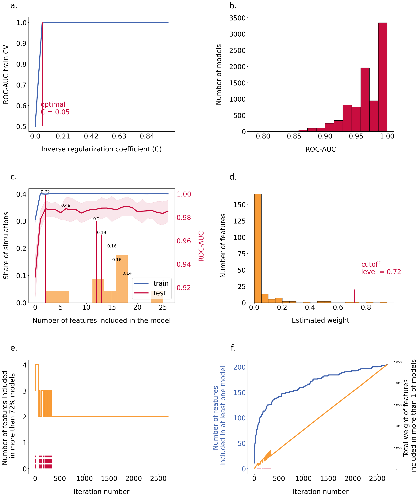
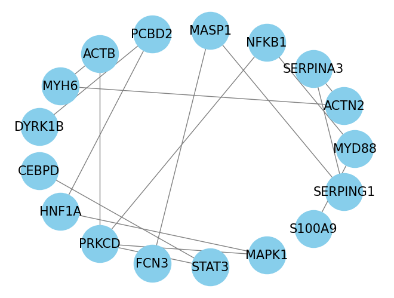
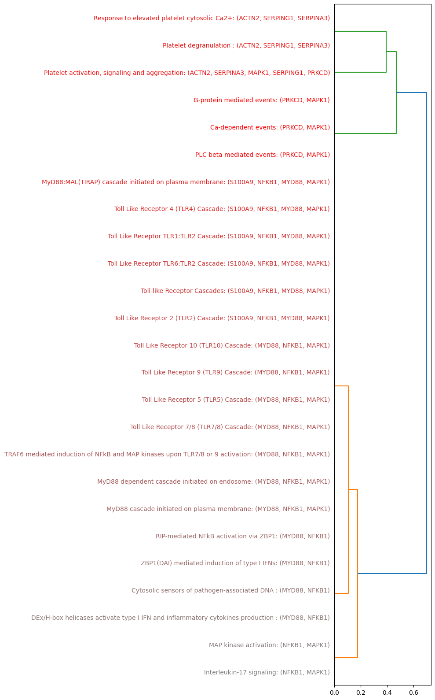

# GeneLens: Integrated DEG Analysis & Biomarker Prediction


[](https://pypi.org/project/genelens/)

## Overview

**GeneLens** is a Python package for functional analysis of differentially expressed genes (DEGs) and biomarker prediction, integrating:
- Machine learning-based biomarker identification
- Graph-based prediction of key regulatory genes via protein-protein interaction networks

Key applications:
- Identification of biomarkers
- Analysis of gene-gene networks

## Features

### Core Modules

1. **NetAnalyzer**
   - Implements graph-based algorithm (Osmak et al. 2020, 2021)
   - Predicts genes functions via topological analysis of molecular networks
   - Features:
     - Automated network construction
     - Centrality analysis
     - Pathway enrichment

2. **FSelector**
   - Machine learning pipeline for biomarker discovery
   - Features:
     - Automated model training/tuning
     - Feature importance analysis
     - Customizable thresholds

### Additional Capabilities
- Standardized analysis pipelines
- Interactive network visualizations
- Support for multi-omics data integration

## Installation

```bash
pip install genelens
```

## Example of use

```python
from genelens.fselector import FeatureSelector, get_feature_space, fsplot
from genelens import netanalyzer, enrichment
from matplotlib import pyplot as plt
import numpy as np
import pandas as pd
import networkx as nx
from importlib.resources import files
```


```python
# data load
data = pd.read_csv(files("genelens").joinpath("data/exampl_data/train_test.csv"), index_col=0)

X = data.drop('index', axis=1)
y = list(map(int, data['index'] == 'HCM'))

print(X.shape)
```

    (145, 14830)


```python
# FeatureSelector initialization
FS_model = FeatureSelector(X, y,
                           C = None, 
                           C_space=np.linspace(0.0001, 1, 20), #bigger space -> more precision, more processor time
                           C_finder_iter=10,
                           cut_off_frac_estimation=True,
                           cut_off_frac_model=0,
                           cut_off_estim_params={'max_feature': 50}) # This parameter implements early stopping. Bigger feature space -> more precision, more processor time
```

    The regularization coefficient was not specified, the search for the optimal C was started


    processing: 100%|███████████████████████████████████████████████████████████████████████████████████████████████████████████████████████████████████████████████████████████████| 10/10 [02:20<00:00, 14.07s/it]


    Optimal regularization coefficient (С) =  0.053
    
    Prefit model for cutoff weight level estimation


    fit model: 100%|████████████████████████████████████████████████████████████████████████████████████████████████████████████████████████████████████████████████████████████| 3000/3000 [12:38<00:00,  3.95it/s]


    Prefit done
    Serching cutoff level for feature weights... 0 

    feature space analysis:  13%|██████████████████▌                                                                                                                               | 27/213 [00:07<00:51,  3.59it/s]


    1 

    feature space analysis:  13%|██████████████████▌                                                                                                                               | 27/213 [00:07<00:51,  3.60it/s]


    2 

    feature space analysis:  13%|██████████████████▌                                                                                                                               | 27/213 [00:07<00:51,  3.59it/s]


    3 

    feature space analysis:  13%|██████████████████▌                                                                                                                               | 27/213 [00:07<00:51,  3.59it/s]


    4 

    feature space analysis:  13%|██████████████████▌                                                                                                                               | 27/213 [00:07<00:51,  3.61it/s]


    5 

    feature space analysis:  13%|██████████████████▌                                                                                                                               | 27/213 [00:07<00:52,  3.57it/s]


    6 

    feature space analysis:  13%|██████████████████▌                                                                                                                               | 27/213 [00:07<00:51,  3.60it/s]


    7 

    feature space analysis:  13%|██████████████████▌                                                                                                                               | 27/213 [00:07<00:52,  3.57it/s]


    8 

    feature space analysis:  13%|██████████████████▌                                                                                                                               | 27/213 [00:07<00:51,  3.61it/s]


    9 

    feature space analysis:  13%|██████████████████▌                                                                                                                               | 27/213 [00:07<00:52,  3.56it/s]

    optimal cut of weight level =  0.72


    


```python
FS_model.fit(max_iter=2700, log=True, feature_resample=0) #more max_iter -> more precision, more processor time
```

    fit model: 100%|████████████████████████████████████████████████████████████████████████████████████████████████████████████████████████████████████████████████████████████| 2700/2700 [11:20<00:00,  3.97it/s]


```python
fsplots = fsplot(FS_model)
fsplots.plot_all(fontsize=25, labels=['a.', 'b.', 'c.', 'd.', 'e.', 'f.'], 
                left=0.1, right=0.9, top=0.9, bottom=0.1, hspace=0.5, wspace=0.5)
plt.show()
```


    

    


```python
print(get_feature_space([FS_model], cut_off_level=0.75))
```

    {'MYH6', 'RASD1'}


```python
FS_model.best_features
```


    {'RASD1': np.float64(0.9510623822037754),
     'MYH6': np.float64(0.8420449794132905)}


## Network Enrichment Analysis


```python
GenGenNetwork = netanalyzer.MainNet() #Load String db and create gene-gene interaction network
GenGenNetwork.get_LCC() #get the largest connected component from the network
```

    LCC was extracted
    Total connected components=146, LCC cardinality=9844


```python
GenGenNetwork.minimum_connected_subgraph(FS_model.best_features)
```

    RASD1 absent from LCC, excluded from further analysis
    CDC42EP4 absent from LCC, excluded from further analysis
    
    mst-graph was extracted
    Initial core feature=1, mst-graph cardinality=0


#### Two of the three selected genes are missing from the version of the String database we are using. Therefore, it is not possible to construct an mst-graph. To continue the analysis, we will select the top 10 genes sorted by their Score


```python
GenGenNetwork.minimum_connected_subgraph(dict(list(FS_model.all_features.items())[:10]))
```

    RASD1 absent from LCC, excluded from further analysis
    CDC42EP4 absent from LCC, excluded from further analysis
    ZFP36 absent from LCC, excluded from further analysis
    
    mst-graph was extracted
    Initial core feature=7, mst-graph cardinality=17


```python
pos = nx.circular_layout(GenGenNetwork.mst_subgraph)

nx.draw(
    GenGenNetwork.mst_subgraph,
    pos,
    with_labels=True,       
    node_color='skyblue',   
    edge_color='gray',      
    node_size=2000,         
    font_size=15            
)

# Показываем граф
plt.show()
```


    

    


```python
enrich_res = enrichment.reactome_enrichment(list(GenGenNetwork.mst_subgraph.nodes()), species='Homo sapiens')
enrich_res = enrichment.reac_pars(enrich_res)
G_enrich = enrichment.get_net(enrich_res) #граф сигнальных путей

reactome_df, raw_res = enrichment.dendro_reactome_to_pandas(enrich_res, G_enrich)

enrichment.get_dendro(reactome_df, FS_model.all_features)
```


    <Figure size 2400x2400 with 0 Axes>


    

    


#### The color gradient from gray to red in the signatures reflects the increase in the weight of genes according to their calculated Score. The redder the signature, the higher the weight.


```python

```
